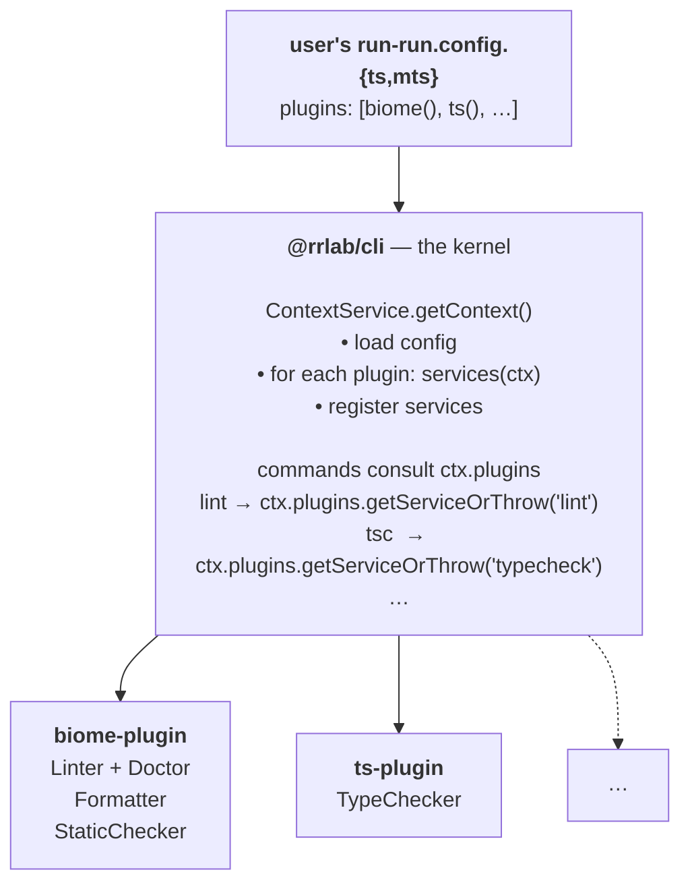

# CLAUDE.md — `run-run/` (the `@rrlab/*` ecosystem)

Orientation for working on the `@rrlab/*` packages. Prerequisite reading: the repo-root `CLAUDE.md` (working principles, build commands, coding conventions).

## Why `rr` exists — and how it's meant to be invoked

`rr` was built to be **the** developer-facing entry point for the recurrent commands a project needs: lint, format, type-check, build, etc. Its whole job is to absorb the per-tool indirection ("which biome flags? which tsc flags? which tsdown config?") behind one consistent CLI. The developer types `rr <cmd>` in the terminal — that is the interface.

This means:

- **Do not wrap `rr` in `package.json` scripts.** Aliases like `"lint": "rr lint"`, `"format": "rr format --fix"`, `"test:types": "rr tsc"`, `"check": "rr check"` re-introduce the very indirection rr was created to remove (`pnpm lint` → `rr lint` → `biome check` is three layers for what should be one). The user types `rr lint`, not `pnpm lint`.
- **The expected setup**: `node_modules/.bin` on `PATH` — typically via mise (`[env] _.path = ["{{config_root}}/node_modules/.bin"]`) — so `rr` is directly invokable from the project root without a package-manager hop. Templates ship a `mise.toml` that wires this for new projects.
- **`package.json scripts` may still exist** — but only for things `rr` does NOT cover (`vitest run`, `tsx watch`, `node dist/...`, `vite dev`, `turbo run dev`, `changeset publish`). These are not single-command aliases; they're either different tools or multi-step compositions.
- **Lifecycle / orchestration hooks MAY call `rr` directly.** lefthook git hooks, `prepublishOnly`, GitHub Actions workflows — those are triggered by other systems, not typed by the developer, so they don't fight the "one entry point" goal. A `pre-commit: rr jsc --fix-staged` lefthook job is exactly right.
- **READMEs teach `rr <cmd>`, not `pnpm <cmd>`.** Mention the mise PATH note once; from then on every developer-facing instruction is `rr <cmd>`.

If you find yourself tempted to add a `pnpm <script>` that exists only to call `rr <cmd>`, stop — it's an anti-pattern that erodes the single-interface property the whole project is built around.

## What's here

| Path | npm name | Role |
|---|---|---|
| `cli/` | `@rrlab/cli` | The kernel. Commander program, plugin registry, `rr` bin. Deep-dive in `cli/CLAUDE.md`. |
| `biome-plugin/` | `@rrlab/biome-plugin` | `lint` + `format` + `jsc` via Biome. |
| `oxc-plugin/` | `@rrlab/oxc-plugin` | `lint` (oxlint) + `format` (oxfmt). `jsc` is composed by the kernel. |
| `ts-plugin/` | `@rrlab/ts-plugin` | `tsc` (TypeScript). Has `install()` that scaffolds `tsconfig.json` from a preset. |
| `tsdown-plugin/` | `@rrlab/tsdown-plugin` | `pack` (tsdown). |
| `ts-config/` | `@rrlab/ts-config` | Shared tsconfig presets: `react`, `dom/app`, `dom/lib`, `no-dom/app`, `no-dom/lib`. |
| `biome-config/` | `@rrlab/biome-config` | Shared biome preset. |

The contract is **kernel-internal** (see root CLAUDE.md). The 4 official plugins are the only consumers we commit to. Evolving the contract is fine as long as you propagate to all 4.

## The kernel is tool-agnostic — non-negotiable

`@rrlab/cli` knows nothing about specific tools (biome, typescript, oxc, tsdown). It only ships **tool-shape-agnostic** things: the plugin contract (`Plugin`, `PluginServices`), capability interfaces (`Linter`, `Formatter`, `TypeChecker`, `Packer`, `StaticChecker`), the file-ops engine (`FileOp`, `JsonEdit`), `ToolService` as a base class, the command tree.

**Each plugin owns its tool.** That includes:

- The tool's version pins (install range + peer range) — see `plugin-*/src/tool-versions.ts`.
- The tool's binary name, package name, CLI surface.
- The tool's config-file shape, install-time scaffolding, uninstall behaviour.
- The tests that keep the plugin's `TOOL_VERSIONS` in sync with its own `package.json` peerDependencies — they live in the plugin too (`plugin-*/src/__tests__/tool-versions.test.ts`).

**The test before adding anything to `@rrlab/cli`:** "If I add a new plugin tomorrow that wraps prettier (or any new tool), does the kernel need to change?" If yes, you're in the wrong layer — push the concept down to the plugin. The kernel must never change to add a plugin.

This rules out, for example:
- A `TOOL_VERSIONS` constant in the kernel listing every official tool. (Each plugin has its own.)
- A `TOOL_PEERS` registry in the kernel mapping plugin alias → peer ranges.
- Kernel-side coherence tests that walk plugin `package.json` files.
- Kernel-exported types that name specific tools (`Biome*`, `Tsdown*`, etc.).

Per-plugin duplication of small constants (the `{ install, peer }` shape repeated in 4 plugins) is the right shape — duplication across plugins is cheap; coupling the kernel to tool details is not.

## Architecture in one screen



Every plugin's host-side tool (`@biomejs/biome`, `typescript`, etc.) is a `peerDependency`. `rr plugins add <alias>` installs it; the kernel never bundles the tool.

## Required reading order before changing anything in here

1. The `decisions/` folder at the repo root. Five load-bearing decisions today:
   - **001** all-peer dependencies.
   - **002** no `bin` shims.
   - **003** wire plugins via the registry (`ctx.plugins`) + drop of `future.oxc`.
   - **004** templating strategy + edit-json DSL.
   - **005** `@rrlab/tsdown-plugin` scaffolding + `@rrlab/tsdown-config` shape.
2. `run-run/cli/CLAUDE.md` if you're going to touch the kernel.
3. The `*.test.ts` files of the area you're modifying. Tests are the executable spec for the existing behaviour.

## Plugin shape (kernel-internal contract)

Every official plugin exports `default = definePlugin({...})` — a plain `PluginDefinition` object (not a factory function). `definePlugin` returns the `(options?) => Plugin` constructor the host's `run-run.config` calls. The definition object:

```ts
{
  name: "<short-name>",         // matches the alias in `PLUGINS_DIRECTORY`
  apiVersion: 1,
  color: (value: string) => string,   // the plugin's brand color; the kernel derives every `ui` label from it
  install?: (ctx: InstallContext) => Promise<InstallResult>,
  uninstall?: (ctx: UninstallContext) => Promise<UninstallResult>,
  services: (ctx: PluginContext) => PluginServices,
}
```

`services()` is called at runtime — every `rr <cmd>` invocation, so it must be cheap. It returns a `PluginServices` map: the capabilities (`lint`, `format`, `jscheck`, `typecheck`, `pack`) the plugin provides, each mapped to the **service** that implements it. Multiple capabilities can share one service (e.g. `BiomeService` is `Linter`, `Formatter`, `StaticChecker`). `definePlugin` owns the cross-cutting wrapping: it applies the `only` narrowing and the dedup bin-probe before handing the map to the kernel, so the `services` function itself only constructs and returns the impls.

`install()` / `uninstall()` are called only by `rr plugins add` / `rr plugins remove`. They return declarative `FileOp[]` + `devDependencies` / `removeDependencies`. The kernel applies them.

### Templating: code-as-template + edit-json DSL

The local config files plugins scaffold are **thin wrappers** pointing at the shared `@rrlab/*-config` package via `extends`. Two flavours of `FileOp`:

```ts
// new file: full content as a string (constructed in code, no template engine)
{
  kind: "create",
  path: "tsconfig.json",
  content: JSON.stringify({ extends: "@rrlab/ts-config/<preset>" }, null, 2) + "\n",
  overwrite?: boolean,
}

// existing file: declarative edits applied via comment-json (preserves comments)
{
  kind: "edit-json",
  path: "biome.json",
  edits: [
    { op: "set",     path: "/$schema", value: "...", mode: "if-missing" },
    { op: "include", path: "/extends", value: "@rrlab/biome-config", position: "start" },
    // ...also: { op: "unset", path }; { op: "exclude", path, value };
  ],
}
```

Paths are JSON Pointer (RFC 6901). Ops are NOT strict RFC 6902 — see `decisions/004-templating-and-edit-json-dsl.md` for why.

For TS modules (`eslint.config.ts` etc. if we ever add them), the escape hatch is `{ kind: "edit-text", path, edit: (src) => string }` — the plugin does AST surgery in-process via `magicast` (already a kernel dep) and returns the new text.

### Adding a new plugin (checklist)

1. `run-run/<tool>-plugin/`: copy the shape of any existing plugin (`biome-plugin` is the most complete reference).
2. `package.json`: declare the wrapped tool as `peerDependencies` + `devDependencies` (matching version). Add `peerDependenciesMeta` for optional peers. Depends on `@rrlab/cli` as peer + dev. Include a `"test": "vitest run"` script.
3. `src/tool-versions.ts`: export a `TOOL_VERSIONS` const mapping each wrapped tool to `{ install, peer }` ranges. Re-export from `src/index.ts` so consumers (and the install hook) read from one place. Never put this in the kernel.
4. `src/index.ts`: export the `<Tool>Service extends ToolService` class, the `install()` and `uninstall()` hooks (consuming `TOOL_VERSIONS.<name>.install` for dev-dep pinning), and `default = definePlugin({...})` (a plain `PluginDefinition` object with a `services(ctx)` method).
5. `vitest.config.ts`: a one-liner `export default defineConfig({})`.
6. `src/__tests__/tool-versions.test.ts`: read this plugin's own `package.json` and assert that every `TOOL_VERSIONS[<name>].peer` matches `peerDependencies[<name>]`. Copy the shape from any sibling plugin's test verbatim — duplication across plugins is cheaper than a kernel-level helper.
7. `src/__tests__/install.test.ts`: cover install (default preset, declined, per-preset deps), uninstall (delete-vs-edit decision). Use `fs.mkdtemp` + a real tmp dir, not mocks.
8. Add the alias to `run-run/cli/src/lib/plugin/directory.ts` `PLUGINS_DIRECTORY`, listing every capability it provides in that entry's `capabilities` array (so the `MissingPluginError` hint — derived via `providersOf(capability)` — suggests it).
9. Add an integration test in `run-run/cli/test/integration/<capability>.test.ts` if the plugin provides a capability that doesn't yet have e2e coverage.
10. If the plugin needs a shared config, create `run-run/<tool>-config/` alongside (mirror `ts-config` / `biome-config`).
11. Update the dogfooded `run-run.config.mts` at the repo root if it makes sense (we use biome + ts + tsdown today).

### Modifying the contract

If you need to evolve `PluginServices`, `FileOp`, `JsonEdit`, `InstallResult`, etc.:

1. Edit `run-run/cli/src/lib/plugin/types.ts`.
2. Update re-exports in `run-run/cli/src/lib/plugin/index.ts`.
3. Update `run-run/cli/src/lib/plugin/registry.ts` if registry semantics change.
4. Update `run-run/cli/src/services/json-edit.ts` if JsonEdit ops change.
5. Update each of the 4 plugins' `install()` / `uninstall()` / `services()` as needed — same commit.
6. Update tests: `run-run/cli/src/lib/plugin/__tests__/registry.test.ts`, `run-run/cli/src/services/__tests__/json-edit.test.ts`, each plugin's tests.
7. Don't add deprecation shims. The contract is internal — propagate the breaking change.

## Tests

- **Plugin unit tests**: `run-run/*-plugin/src/__tests__/*.test.ts`. Run via `pnpm --filter @rrlab/<tool>-plugin test`.
- **Kernel unit tests**: `run-run/cli/src/**/__tests__/*.test.ts`.
- **Kernel integration tests** (spawn the `rr` bin against a tmp fixture): `run-run/cli/test/integration/*.test.ts`. Use `makeFixture(name, files)` and `fixtures.config([...aliases])` from `run-run/cli/test/helpers.ts`. The helper symlinks the workspace's `node_modules` into the fixture so the fixture's generated `run-run.config.mts` can resolve `@rrlab/*-plugin` packages.

When adding integration tests for a new plugin, the canonical shape is:

```ts
fixture = makeFixture("name", {
  "package.json": fixtures.pkg(),
  "run-run.config.mts": fixtures.config(["alias"]),
  // plus any tool-specific config (biome.json, tsconfig.json) or fixtures
});
```

## What NOT to touch in here

- `@vlandoss/clibuddy` and `@vlandoss/loggy` are dependencies — fixing bugs there is fine, but don't refactor their API while doing run-run work. Open a separate task.
- `@vlandoss/vland` lives in `packages/` and is a different product. Touching it is out of scope for run-run work.
- The published name of any `@rrlab/*` package — that's a public-facing decision the human owns.
